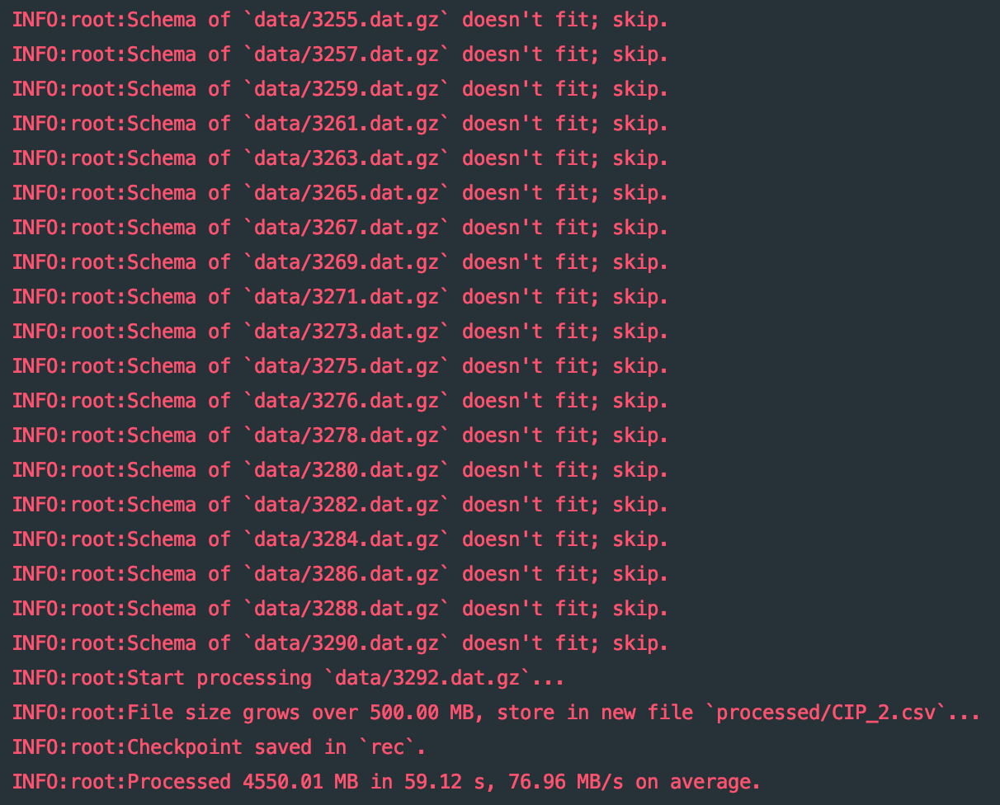
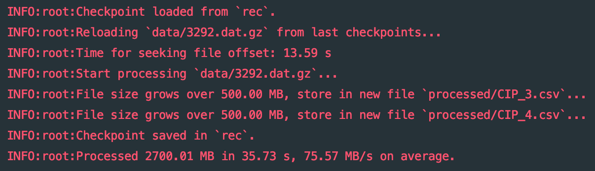

# pgsql-dump-parser

pgdump文件解析脚本，从数据库大文件（.gz，.dat，……）导出所需的表的数据为csv格式文件。

使用场景：将大文件内容按照某个字段分类，并存入各个类别的文件。

### 处理过程：

- 处理过程中会产生一个叫processed的文件夹，并将各种文件按照包序号顺序处理并保存
- 对格式支持处理的文件进行数据格式测试，查看是否为所需的表的数据，不是则跳过
- 分批次读取文件内容到内存，并按行处理
- 为了保证有序性，采取单线程处理文件（当然也是因为写起来简单）
- 支持文件和目录的处理，其中对目录可采取递归处理方式处理其中包含所有复合格式的文件
- 支持断点续处理，在意外中断（比如键盘中断）的情况下可以把断点位置保存在文件，下次重新执行的时候会优先处理断点文件

### 使用方法

`python3 process.py [./data1/] [.data2/] [.data.txt] [...]`

支持多个文件/目录混合处理。

### 自定义功能

通过修改config.py内容（详见注释部分），可以做到：

- 自定义多种文件解析，关联后缀名与对应读取函数（gzip.open(mode='rb'), open(mode='rb'),...）
- 大文件分割，将解析输出的文件以file_split_size为一个单位进行解析（如，默认每个文件500MB），文件末尾自动添加序号
- 自定义单次读取字符数（合适的读取数将提高IO效率）
- 选择是否递归解析文件夹内容
- **重要**：修改需要分类的字段（列）序号（从0开始），分类的可能值，并设置保存的字段列表
  - 例如：需要按照某张表第2个字段的值（假设该字段为性别，值包括`male`和`female`）进行分类，并保留该表的1，2，3，4字段（比如是序号，姓名，性别，年龄）

### 速度

解析速度为80-100MB/s左右（可能存在误差，对于.gz文件指的是解压读取的文件速度）

### 运行截图

首次运行：

断点恢复：

